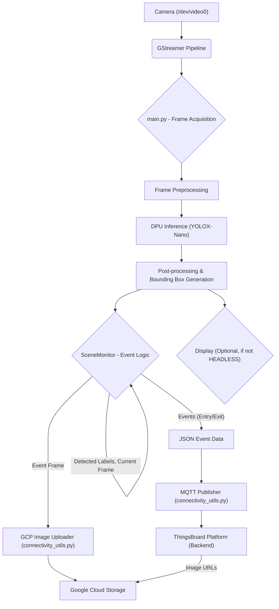

# Project Introduction: IoT Event Detection System

This project implements an optimized and extensible architecture for real-time object detection using an edge device based on the Xilinx/AMD Kria KR260 platform (or similar, with DPU). The solution is designed for scene analysis based on the presence and absence of objects, integrating directly with an IoT messaging infrastructure.

## Main Objectives

*   **Hardware Acceleration:** Utilize the DPU (Deep Learning Processor Unit) in the Programmable Logic (PL) of the System-on-Chip (SoC) to execute inference for models like YOLOX-Nano, maximizing performance (FPS).
*   **Event Detection (Analytics):** Transition from continuous detection to an intelligent event system (Entry/Exit) with configurable time hysteresis (debounce logic) to mitigate jitter and record only significant events.
*   **Cloud/IoT Integration:** Publish event metadata in JSON format to an MQTT broker (e.g., Mosquitto) and upload visual evidence (images) directly to Google Cloud Storage (GCP), facilitating integration with ThingsBoard dashboards and backend systems.

## Key Technologies

*   **Base Hardware:** Xilinx/AMD Kria KR260 (or PYNQ/DPU compatible).
*   **Computer Vision:** YOLOX-Nano.
*   **Language/Framework:** Python, PYNQ Overlay.
*   **Connectivity:** MQTT (paho-mqtt) and Google Cloud Storage SDK.
*   **Backend & Storage:** ThingsBoard for backend management, including data storage (PostgreSQL) and visualization; Google Cloud Storage for image archiving.

# Kria Object Detection with YOLOX-Nano and PYNQ

This project demonstrates real-time object detection on a Xilinx Kria SOM (System-on-Module) using the YOLOX-Nano model accelerated by the DPU (Deep Learning Processor Unit) via the PYNQ framework. It features event-driven logging, MQTT integration for event publishing, and Google Cloud Storage (GCS) for image uploads.

## Features

*   **Real-time Object Detection:** Utilizes the YOLOX-Nano model for efficient object detection.
*   **DPU Acceleration:** Leverages the Xilinx DPU for high-performance inference.
*   **PYNQ Framework:** Simplifies interaction with the Kria's hardware accelerators from Python.
*   **Event-Driven Logging:** `SceneMonitor` tracks object entries and exits with configurable delays, capturing frames at the moment of the event.
*   **MQTT Integration:** Publishes object detection events (entry/exit) to a configurable MQTT broker, designed for seamless integration with IoT platforms like ThingsBoard.
*   **Google Cloud Storage Integration:** Uploads event-triggered images to a specified GCS bucket for long-term storage and access.
*   **Configurable Parameters:** Various aspects of the application can be configured via environment variables or command-line arguments.
*   **GStreamer Camera Input:** Uses GStreamer pipeline for efficient camera frame acquisition.

## Application Architecture

The application is structured around several key components, with ThingsBoard handling the entire backend for data management and visualization:

1.  **Camera Input (`main.py`):**
    *   A GStreamer pipeline captures frames from `/dev/video0`.
    *   OpenCV (`cv2`) is used to read these frames.

2.  **DPU Overlay & Model Loading (`main.py`):**
    *   PYNQ's `DpuOverlay` loads the pre-compiled DPU bitstream (`dpu.bit` and `dpu.hwh`) onto the Kria SOM.
    *   The YOLOX-Nano model (`yolox_nano_pt.xmodel`) is loaded onto the DPU for inference.

3.  **Object Detection Inference (`main.py`):**
    *   The `run` function preprocesses camera frames, executes inference on the DPU, and post-processes the raw DPU output to generate bounding boxes, scores, and class IDs.
    *   It uses `coco2017_classes.txt` for class name mapping.

4.  **Scene Monitoring (`main.py`):**
    *   The `SceneMonitor` class observes detected objects over time.
    *   It defines "entry" and "exit" events based on configurable delays (`LOG_ENTRY_DELAY_MS`, `LOG_EXIT_DELAY_MS`).
    *   When an event is triggered, it saves the relevant frame to the `CAPTURES_DIR`.

5.  **External Connectivity (`connectivity_utils.py`):**
    *   **MQTT Publisher:** Publishes JSON-formatted event data to a dynamic MQTT topic (e.g., `kria-vision/<object_class>/events/<event_type>`). These events are consumed by ThingsBoard for real-time telemetry, rule processing, and dashboard updates.
    *   **GCP Image Uploader:** Uploads the captured event images to a specified Google Cloud Storage bucket. ThingsBoard can then link to these images for a complete event record.
    *   These functionalities are exposed via `publish_event_to_mqtt` and `upload_image_to_gcp` functions, used by `main.py`.

6.  **Backend (ThingsBoard):**
    *   ThingsBoard receives MQTT messages from the Kria device.
    *   It processes event metadata, stores it (typically in PostgreSQL), and enables rule-based actions, alarms, and data visualization through customizable dashboards.
    *   ThingsBoard also manages links to images stored in GCP, providing a comprehensive view of events.

7.  **Display (Optional):**
    *   If not running in headless mode, `main.py` displays the live camera feed with detected bounding boxes using OpenCV.



## PYNQ Approach

PYNQ (Python Productivity for Zynq) is an open-source framework that enables embedded system developers to exploit the capabilities of Xilinx Zynq SoCs (System-on-Chips) and Versal ACAPs with Python.

In this project, PYNQ is used to:

*   **Load Hardware Overlays:** The `DpuOverlay("dpu.bit")` command loads the pre-synthesized DPU hardware design onto the Kria SOM's programmable logic. This includes the DPU IP core.
*   **Interact with the DPU:** The `pynq_dpu` library provides a high-level Python API to configure and control the DPU. It handles memory allocation, data transfers, and execution of deep learning models (`.xmodel` files) on the DPU.
*   **GPIO Control:** For demonstration or integration with other hardware, PYNQ can also control GPIOs, as seen in `demo_blink.py` (e.g., `AxiGPIO`).

This approach allows rapid prototyping and deployment of AI-accelerated applications by abstracting the complexities of hardware interaction, allowing developers to focus on the Python-based application logic.

## Configurability

The application's behavior can be customized using environment variables or command-line arguments.

### `main.py` Arguments

*   `--headless`: Run the application without displaying the video feed. Overrides the `HEADLESS` environment variable if both are present.

### Environment Variables

These variables should be set in your environment (e.g., in a `.env` file and loaded using `dotenv`) before running `main.py` or `connectivity_test.py`.

*   **`HEADLESS`**: (`true` or `false`, default: `false`) If set to `true`, the application will not display the video feed. This is useful for remote deployments.
*   **`LOG_ENTRY_DELAY_MS`**: (Integer, default: `500`) The time in milliseconds an object must be continuously detected to trigger an "entry" event.
*   **`LOG_EXIT_DELAY_MS`**: (Integer, default: `500`) The time in milliseconds an object must be continuously *absent* after being "active" to trigger an "exit" event.
*   **`CAPTURES_DIR`**: (String, default: `./captures`) The directory where event-triggered images will be saved locally.

#### Connectivity Configuration (`connectivity_utils.py`)

*   **`MQTT_HOST`**: (String, default: `localhost`) The hostname or IP address of the MQTT broker.
*   **`MQTT_PORT`**: (Integer, default: `1883`) The port of the MQTT broker.
*   **`MQTT_TOPIC`**: (String, default: `kria/events`) The base topic for MQTT messages. The actual topic for events will be `kria-vision/<object_class>/events/<event_type>`.
*   **`MQTT_CLIENT`**: (String, default: `usr`) The username for MQTT broker authentication.
*   **`GCP_BUCKET`**: (String, **REQUIRED for GCP upload**) The name of the Google Cloud Storage bucket to upload images to.

## Setup Guide

This guide will walk you through setting up the Kria SOM and the project environment.

### Prerequisites

*   **Xilinx Kria SOM:** KR260 or KV260 with Kria uubntu image installed.
*   **PYNQ v3.0.1 or later:** Ensure PYNQ is properly installed and configured on your Kria board.
*   **Camera:** A V4L2 compatible camera connected to the Kria SOM (e.g., via USB).
*   **Google Cloud Account:** For GCP storage functionality, with a project, a bucket, and service account credentials configured (typically via `GOOGLE_APPLICATION_CREDENTIALS` environment variable pointing to a JSON key file).
*   **ThingsBoard Instance:** A running ThingsBoard instance (cloud or self-hosted) configured to receive data from your device.

### 1. Clone the Repository

```bash
git clone https://github.com/J-Guevara12/kria-object-detect
cd kria-object-detect
```

### 2. Environment Setup

It's highly recommended to use the pynq default Python virtual environment.

```bash
# Use the provided script
source activate_env.sh
```

### 3. Install Dependencies

Install the necessary Python packages.

```bash
pip install paho-mqtt google-cloud-storage
```

### 4. Hardware Overlay and Model Files

Ensure the DPU overlay and the YOLOX-nano model files are in the project root:

*   `dpu.bit`
*   `dpu.hwh`
*   `dpu.xclbin`
*   `yolox_nano_pt.xmodel`

And the class labels file is in the `img/` directory:

*   `img/coco2017_classes.txt`

These files are typically generated by Vitis AI and Xilinx tools.

### 5. Configuration (`.env` Example)

Create a `.env` file in the project root to manage your environment variables.

```ini
# .env example
# Core Application Settings
HEADLESS=false
LOG_ENTRY_DELAY_MS=1000
LOG_EXIT_DELAY_MS=2000
CAPTURES_DIR=./captures

# MQTT Configuration
MQTT_HOST=your_mqtt_broker_ip_or_hostname
MQTT_PORT=1883
MQTT_TOPIC=kria/events
MQTT_CLIENT=kria_user

# Google Cloud Storage Configuration
# REQUIRED for GCP upload functionality.
GCP_BUCKET=your_gcp_bucket_name

# For GCP authentication, typically set GOOGLE_APPLICATION_CREDENTIALS
# to the path of your service account key file in your shell, e.g.:
# export GOOGLE_APPLICATION_CREDENTIALS="/path/to/your/service-account-key.json"
```


### 7. Install Gstreamer

In order to simplify the image capture pipeline, GStreamer is used to handle the `V4L2` output:

First install UVC (USB Video Class)

```
sudo apt update
sudo apt install cmake
sudo apt install libusb-1.0-0-dev

sudo su
git clone https://github.com/nickel110/libuvc.git
cd libuvc/
mkdir build
cd build/
cmake ..
make && sudo make install
```

Then you can install GStreamer:

```
sudo apt install libgstreamer1.0-dev libgstreamer-plugins-base1.0-dev libgstreamer-plugins-bad1.0-dev gstreamer1.0-plugins-base gstreamer1.0-plugins-good gstreamer1.0-plugins-bad gstreamer1.0-plugins-ugly gstreamer1.0-libav gstreamer1.0-tools gstreamer1.0-x gstreamer1.0-alsa gstreamer1.0-gl gstreamer1.0-gtk3 gstreamer1.0-qt5 gstreamer1.0-pulseaudio
sudo apt install v4l2loopback-dkms
```

### 6. Run the Application

Once everything is set up, you can run the main object detection application:

```bash
python3 main.py
# To run in headless mode (no display):
# python3 main.py --headless
# Or with environment variable (if not overridden by --headless argument):
# HEADLESS=true python3 main.py
```

### 7. Run Connectivity Test (Optional)

You can test the MQTT and GCP connectivity independently using the `connectivity_test.py` script.
**Note:** `connectivity_test.py` requires `numpy` and `opencv-python` to generate a temporary test image.

```bash
# Example usage:
python3 connectivity_test.py --gcp_bucket your_gcp_bucket_name --mqtt_host your_mqtt_broker_ip
```

## Hardware Blink Demo

The `demo_blink.py` script is a simple example demonstrating how to control a GPIO on the Kria board using PYNQ, specifically to blink an LED. This is separate from the main object detection application but can be used for basic hardware verification.

```bash
python3 demo_blink.py
```

This script expects a hardware overlay named `blink_design.bit` and `blink_design.hwh` to be present, which contains an AXI GPIO IP block.
